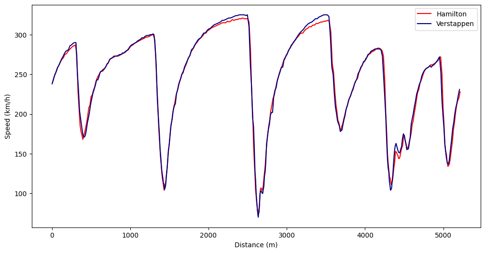
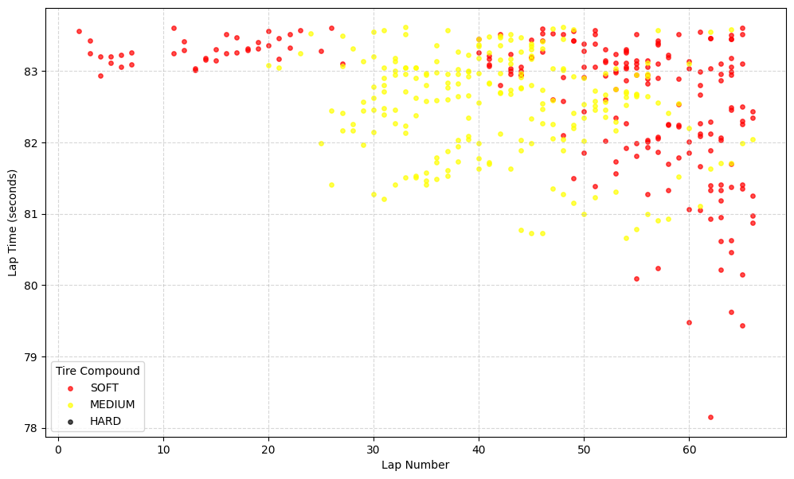

# F1 Data Analysis

This project explores Formula 1 data using Python to uncover the fine margins that define professional racing. By leveraging the FastF1 library, I analyze driver performance and tire strategies from the 2021 season.

## Project Overview
The goal of this repository is to demonstrate data science techniques applied to high-speed telemetry. The project focuses on two main areas:
1. **Telemetry Analysis**: Comparing the fastest qualifying laps of the 2021 title contenders.
2. **Tire Degradation Modeling**: Visualizing how different compounds lose performance over a race distance.

## Tech Stack
* **Language**: Python 3.12+
* **Libraries**: 
  * `FastF1` (Telemetry and race data)
  * `Pandas` (Data cleaning and manipulation)
  * `Matplotlib` (Data visualization)
* **Environment**: Jupyter Notebook (VS Code)

## Features

### 1. Hamilton vs. Verstappen: The Battle for Abu Dhabi
An in-depth look at the telemetry from the 2021 Abu Dhabi Qualifying session. 
- **Insights**: Analysis of top speeds, braking points, and cornering efficiency.
- **Tools used**: Time-series data processing, distance-based telemetry mapping.

### 2. Tire Degradation Analysis (Spanish GP)
Comparing Soft, Medium, and Hard compounds during the race.
- **Insights**: Visualizing the performance drop-off (degradation) vs. fuel load correction.
- **Data Cleaning**: Filtering pit-stop "noise" and Safety Car periods to find pure racing pace.

